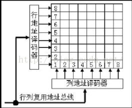
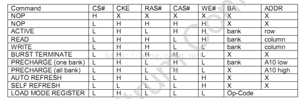
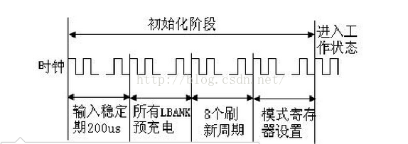
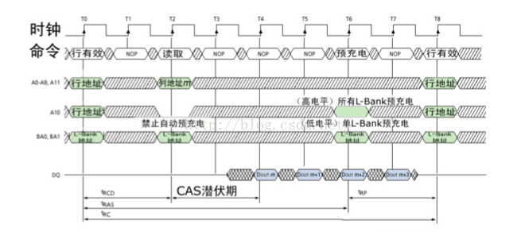

DDR3模块读写测试
====================

简介
--------------------

DRAM内部分割成多个L-Bank，每个L-Bank形状相同，彼此独立，可以独立工作。早期的DRAM芯片内部分为2个L-Bank，后来是4个，DDR3内存芯片为8个。在进行寻址时需要先确定是哪个L-Bank，然后再在这个选定的L-Bank中选择相应的行与列进行寻址。对内存的访问，一次只能是一个L-Bank，而每次与CPU交换的数据就是 L-Bank 存储阵列中一个“存储单元”的容量。SDRAM内存芯片一次传输的数据量就是芯片的位宽，那么这个存储单元的容量就是芯片的位宽（也是 L-Bank 的位宽）。下图为4BANK内存颗粒内部结构示意图。

针对内存的操作指令有如下几种：        
1).Command INHIBIT(初始化)；  
2).No Operation(无动作)；         
3).Active(使指定L-Bank中的指定行有效)；        
4).Read(从指定L-Bank中的指定列开始读取数据)；        
5).Write(从指定L-Bank中的指定列开始写入数据)；       
6).Burst Terminate(突发传输终止)；         
7).Precharge(预充电命令，关闭指定或全部L-Bank中的工作行)；        
8).Auto Refresh(自动刷新)；         
9).Load Mode Register(模式寄存器加载)；
10).写允许/输出允许；         
11).写禁止/输出屏蔽

基本命令是通过操作各种控制信号/地址信号的组合来完成。下表中除了自刷新命令外，所有命令都是默认CKE有效（其中H代表高电平，L代表低电平，X 表示高低电平没有影响）。

### 内存的初始化     

 一旦VDD、VDDQ被同时家电，并且时钟已经稳定，SDRAM需要一个200us的延迟，在这个时间段中，Command INHIBIT和No Operation指令有效，这个过程实际上就是内存的自检过程，一旦这个过程通过后，一个Precharge命令就会生效，在这个命令周期中，内存会处于Idle状态。随后执行几个Auto Refresh周期，之后SDRAM为模式寄存器编程做准备。整个初始化过程如下图所示，其中前3个操作应该都是DDR内部自动完成的。

参数解释：

下图为一个完整的从行寻址到行关闭的时序图（其中tRCD=2、CL=2、tRP=2） 。

tRCD (RAS to CAS Delay / ACTIVE to READ/WRITE delay):

表示行寻址到列寻址延迟时间。从行有效到读/写命令发出之间的间隔被定义为tRCD，也叫行选通周期。这是根据存储阵列电子元件响应时间（从一种状态到另一种状态变化的过程）所制定的延迟。
CL (CAS latency):

表示内存读作前列地址选通的潜伏时间。相关的列地址被选中之后，将会触发数据传输，但从存储单元中输出到真正出现在内存芯片的 I/O 接口之间还需要一定的时间（数据的触发有延迟，而且还需要进行信号放大）。  这个参数控制内存接收到一条数据读取指令后要等待多少个时钟周期。同时该参数也决定了在一次内存突发传送过程中完成第一部分传送所需要的时钟周期数。在保证稳定性的前提下，CL值越小，则内存的速度越快。  CL是找到数据的最后一个步骤，也是内存参数中最重要的参数。

tRP (Row precharging time):

表示行预充电时间。tRP用来设定在另一行能被激活之前，现有的工作行需要的充电时间。从开始关闭现有的工作行，到可以打开新的工作行之间的间隔就是tRP。
tRAS(Row Active Time / Active to Precharge Delay):

 表示从内存行有效命令发出至预充电命令发出之间的最短时间。  如果tRAS的周期太长，系统会因为无谓的等待而降低性能。如果tRAS的周期太短，则可能因缺乏足够的时间而无法完成数据的突发传输，这样会引发丢失数据或损坏数据。

tRC (Row cycle time):

表示“ SDRAM行周期时间 ”，它是 包括行单元预充电到激活在内的整个过程所需要的最小的时钟周期数 。其计算公式是： (tRC) =(tRAS) + (tRP)。
tDQSS（ WRITE Command to the first corresponding rising edge of DQS）：
发出写入命令后，DQS与写入数据要等一段时间才会送达。为什么要有这样的延迟设计呢？原因也在于同步，毕竟一个时钟周期两次传送，需要很高的控制精度，它必须要等接收方做好充分的准备才行。tDQSS是DDR内存写入操作的一个重要参数，太短的话恐怕接受有误，太长则会造成总线空闲。tDQSS最短不能小于0.75个时钟周期，最长不能超过1.25个时钟周期。有人可能会说，如果这样，DQS不就与芯片内的时钟不同步了吗？对，正常情况下，tDQSS是一个时钟周期，但写入时接受方的时钟只用来控制命令信号的同步，而数据的接受则完全依靠DQS进行同步，所以 DQS与时钟不同步也无所谓。不过，tDQSS产生了一个不利影响——读后写操作延迟的增加，如果CL=2.5，还要在tDQSS基础上加入半个时钟周期，因为命令都要在CK的上升沿发出。
tMRD(Mode Register Delay) ：

 表示在进行初始化时，从LOAD MODE REGISTER命令发出到可以执行ACTIVE / REFRESH命令的时间。

tWR(Write Recovery Time)：

 表示写恢复延时。指在一个激活的bank中完成有效的写操作及预充电前，必须等待多少个时钟周期。  这段必须的时钟周期用来确保在预充电发生前，写缓冲中的数据可以被写进内存单元中。过低的tWR虽然提高了系统性能，但可能导致数据还未被正确写入到内存单元中，就发生了预充电操作，会导致数据的丢失及损坏。
tRFC(AUTO REFRESH Command period) ：

 表示Auto Refresh所需要的时间。
tRRD(Row to Row Delay / RAS to RAS delay / ACTIVE to ACTIVE delay) ：

表示行单元到行单元的延时。该值也表示向相同bank中的同一个行单元两次发送激活指令之间的时间间隔。tRRD值越小越好，延迟越低表示下一个行能更快地被激活，进行读写操作。

参考代码
--------------------
https://github.com/C-Elegans/ddr3_controller