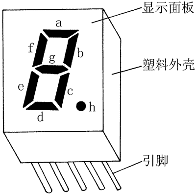

七段数码管译码器
===

简介
---
七段数码管是利用7段发光数码管来拼成常见的数字和某些字母。再加上右下脚的小数点，实际上一个显示电源包含了8根控制信号线。

本模块实现了一个七段共阴极数码管的译码器。其有1个4位的输入hex，hex是输入的数字(从0x0到0xf)，1个1位的输入dp，用于控制小数点的显示，以及1个8位的输出seg。

seg[7]为小数点的显示信号，1为亮起，0为熄灭。seg[6]-seg[0]控制数码管的亮灭。seg[0]对应a，seg[1]对应b，以此类推。我们假设我们使用共阴极数码管，即0为熄灭，1位亮起。

你可以使用Case语句完成这个模块。

数字与七段数码管的对应表：
| 数字            | 0   | 1   | 2   | 3   | 4   | 5   | 6   | 7   | 8   | 9   | a   | b   | c   | d   | e   | f   |
| --------------- | --- | --- | --- | --- | --- | --- | --- | --- | --- | --- | --- | --- | --- | --- | --- | --- |
| 共阴极表示(HEX) | 3f  | 06  | 5b  | 4f  | 66  | 6d  | 7d  | 07  | 7f  | 6f  | 77  | 7c  | 39  | 5e  | 79  | 71  |

测试用例与参考输出
---
| 序号 | hex | dp  | seg  |
| ---- | --- | --- | ---- |
| 1    | 0x0 | 0   | 0x3f |
| 2    | 0x1 | 1   | 0x86 |
| 3    | 0x2 | 0   | 0x5b |
| 4    | 0x3 | 1   | 0xcf |
| 5    | 0x4 | 0   | 0x66 |
| 6    | 0x5 | 1   | 0xed |
| 7    | 0x6 | 0   | 0x7d |
| 8    | 0x7 | 1   | 0x87 |
| 9    | 0x8 | 0   | 0x7f |
| 10   | 0x9 | 1   | 0xef |
| 11   | 0xa | 0   | 0x77 |
| 12   | 0xb | 1   | 0xfc |
| 13   | 0xc | 0   | 0x39 |
| 14   | 0xd | 1   | 0xde |
| 15   | 0xe | 0   | 0x79 |
| 16   | 0xf | 1   | 0xf1 |

参考代码
---
参见 https://github.com/wkxfudan/verilog_case/Encoder
