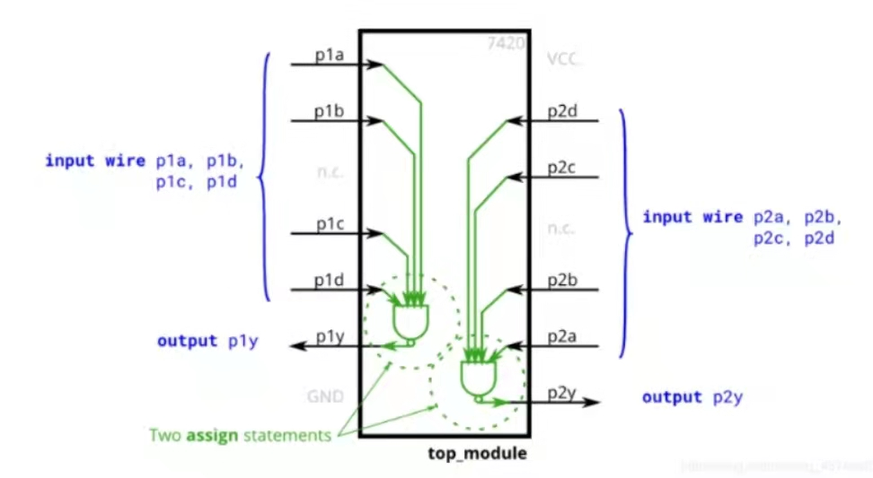

7420双非四输入逻辑门
================================================================

图为该模块要实现的7420芯片，具有两个四输入与非门。要创建与7420芯片功能相同的模块，需要8个输入和两个输出。

测试用例与参考输出
================================================================
序号|A1|B1|C1|D1|A2|B2|C2|D2|OUT1|OUT2
--|:--:|:--:|:--:|:--:|:--:|:--:|:--:|:--:|--:|:--:
1|0|0|0|0|0|0|0|0|1|1
2|0|0|0|1|0|0|1|1|1|1
3|0|0|1|1|0|1|1|1|1|1
4|0|0|1|0|1|1|1|1|1|0
5|0|1|0|0|0|1|0|1|1|1
6|0|1|0|1|0|0|1|0|1|1
7|1|1|1|1|0|1|0|1|0|1
8|1|1|1|1|1|1|1|1|0|0

