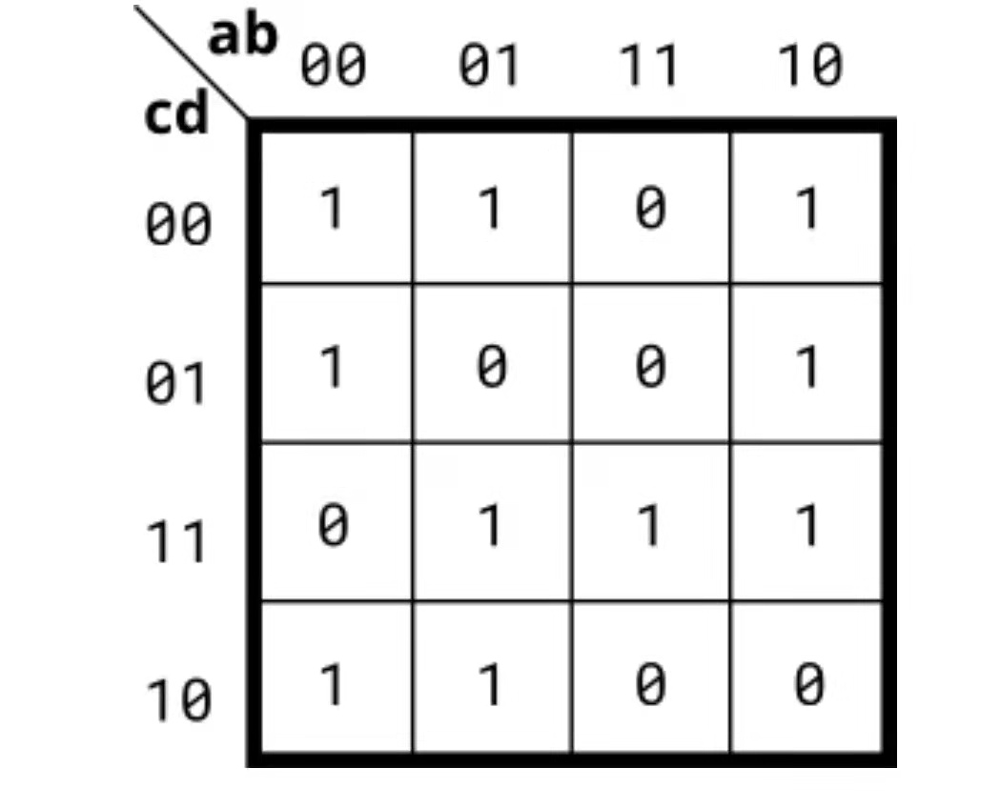

三输入卡诺图逻辑门
================================================================

图为该模块要实现的简单组合逻辑电路
根据卡诺图进行化简后 out=(~b & ~c) | (~a & ~d) | (b & c & d) |(a & ~b & d);

该电路有4个1位的输入a，b，c，d,以及1个1位的输出out。a，b，c,d由外部电路进行驱动，out由a，b，c,d进行驱动。
