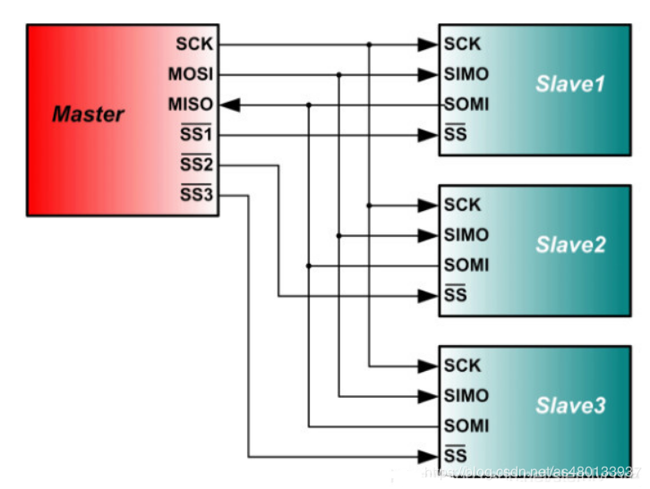

SPI协议
================================================================

简介
----------------------------------------------------------------

SPI(Serial Peripheral Interface)，是一种“一主多从”的同步通信方式。它的方式是“全速高双工”（允许通信双方同时收发信息）速度非常快，SPI 接口的读写操作，都是由主设备发起。当存在多个从设备时，通过各自的片选信号进行管理

它的接线除了时钟线与两根数据线之外，还需要每个设备的自己的 SS 线

### 信号线
SCLK：串行时钟信号，由主设备产生
MISO：主设备输入 / 从设备输出引脚。该引脚在从模式下发送数据，在主模式下接收数据
MOSI：主设备输出 / 从设备输入引脚。该引脚在主模式下发送数据，在从模式下接收数据
CS/SS：从设备片选信号，由主设备控制。它的功能是用来作为“片选引脚”，也就是选择指定的从设备，让主设备可以单独地与特定从设备通讯，避免数据线上的冲突

### SPI 数据发送

传输细节

SPI 主机和从机都有一个串行移位寄存器，主机通过向它的 SPI 串行寄存器写入一个字节来发起一次传输：

首先拉低对应 SS 信号线，表示与该设备进行通信
主机通过发送 SCLK 时钟信号，来告诉从机写数据或者读数据。这里要注意，SCLK 时钟信号可能是低电平有效，也可能是高电平有效，因为 SPI 有四种模式，这个在下面会介绍
主机 (Master) 将要发送的数据写到发送数据缓存区 (Memory)，缓存区经过移位寄存器 (0~7)，串行移位寄存器通过 MOSI 信号线将字节一位一位的移出去传送给从机，同时 MISO 接口接收到的数据经过移位寄存器一位一位的移到接收缓存区
从机 (Slave) 也将自己的串行移位寄存器 (0~7) 中的内容通过 MISO 信号线返回给主机。同时通过 MOSI 信号线接收主机发送的数据，这样，两个移位寄存器中的内容就被交换。

也就是讲，在 SPI 通讯中，没有特定的去读与写的操作，而是主机与从机之间交换数据的过程，但是主机占的主导地位。要想读到从机的数据，主机就必须发送一些数据来进行交换。也就是说，你发一个数据必然会收到一个数据；你要收一个数据必须也要先发一个数据。

参考代码
---------------
参见https://github.com/nandland/spi-master