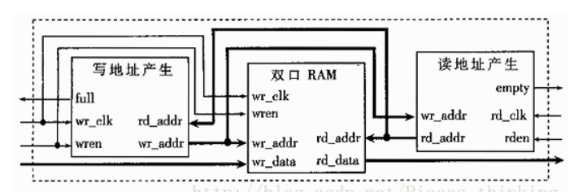

异步FIFO
================================================================

简介
----------------------------------------------------------------

 FIFO （先进先出队列）是一种在电子系统得到广泛应用的器件，通常用于数据的缓存和用于容纳异步信号的频率或相位的差异。FIFO的实现通常是利用双口RAM和读写地址产生模块来实现的。FIFO的接口信号包括异步的写时钟（wr_clk）和读时钟（rd_clk）、与写时钟同步的写有效（wren）和写数据（wr_data）、与读时钟同步的读有效（rden）和读数据（rd_data）。为了实现正确的读写和避免FIFO的上溢或下溢，通常还应该给出与读时钟和写时钟同步的FIFO的空标志（empty）和满标志（full）以禁止读写操作。

### 异步FIFO功能描述

下图给出了FIFO的接口信号和内部模块图。

由图可以看出，写地址产生模块根据写时钟和写有效信号产生递增的写地址，读地址产生模块根据读时钟和读有效信号产生递增的读地址。FIFO的操作如下：在写时钟wr_clk的上升沿，当wren有效时，将wr_data写入双口RAM中写地址对应的位置中；始终将读地址对应的双口RAM中的数据输出到读数据总线上。这样就实现了先进先出的功能。
这里写图片描述

写地址产生模块还根据读地址和写地址关系产生FIFO的满标志。当wren有效时，若写地址+2=读地址时，full为1；当wren无效时，若写地址+ 1=读地址时，full为1。读地址产生模块还根据读地址和写地址的差产生FIFO的空标志。当rden有效时，若写地址-1=读地址时，empty为 1；当rden无效时，若写地址=读地址时，empty为1。按照以上方式产生标志信号是为了提前一个时钟周期产生对应的标志信号。

由于空标志和满标志控制了FIFO的操作，因此标志错误会引起操作的错误。如上所述，标志的产生是通过对读写地址的比较产生的，当读写时钟完全异步时，对读写地址进行比较时，可能得出错误的结果。例如，在读地址变化过程中，由于读地址的各位变化并不同步，计算读写地址的差值，可能产生错误的差值，导致产生错误的满标志信号。若将未满标志置为满标志时，可能降低了应用的性能，降低写数据速率；而将满置标志置为未满时，执行一次写操作，则可能产生溢出错误，这对于实际应用来说是绝对应该避免的。空标志信号的产生也可能产生类似的错误。

### 异步FIFO的改进设计

从以上分析中可以看出，异步FIFO之所以会发生错误是因为在地址变化时，由于多位地址各位变化时间不同，异步时钟对其进行采样时数值可能为不同于地址变化后数值的其它值，异步产生错误的空标志和满标志，以致于产生FIFO的操作错误。

格雷码是一种在相邻计数值之间只有一位发生变化的编码方式。可以看出，若读写地址采用格雷码编码方式，就可以解决上面的问题。

参考代码
------------------------------------------------

参见https://www.cnblogs.com/mikewolf2002/p/10945488.html